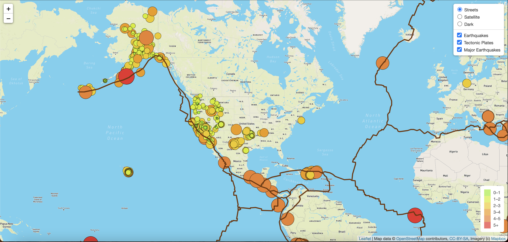

# Mapping Earthquakes

## Overview

The purpose of this challenge was to visually show the differences of earthquake magnitudes all over the world.  This was done by using JavaScript and the D3.js library to retrieve coordinates and magnitudes of the earthquakes from the GeoJSON data from the USGS API.  The data was then used to create an interactive map using a Mapbox map through an API request.  On the map, a user can see the relationship of tectonic plates' location on earth and where earthquakes occure along them with their magnitude size. 

The interactive map can be seen here : https://jason-martinovich.github.io/earthquake_visual/

